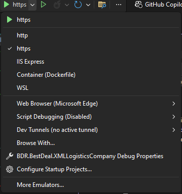
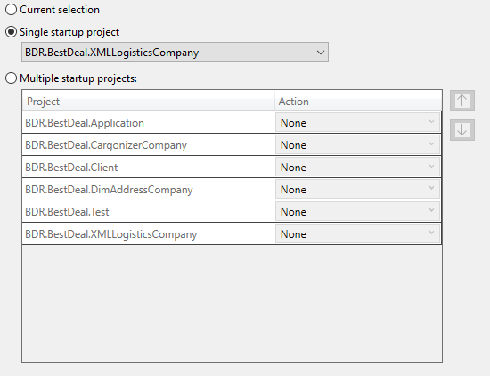
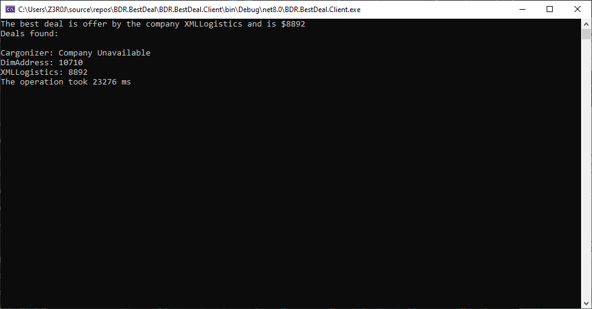
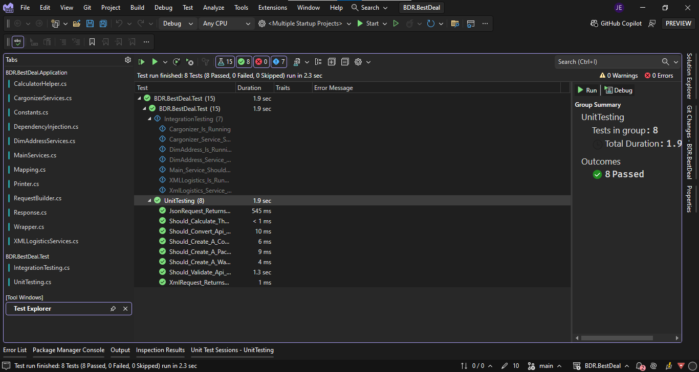
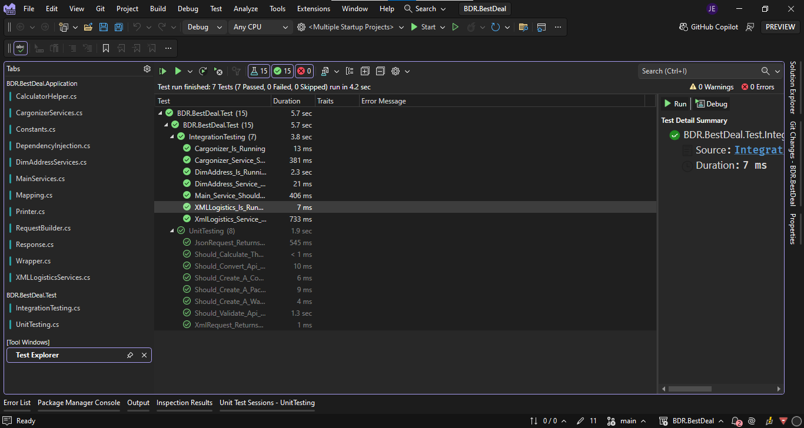

## BEST DEAL (TEST ASSIGNMENT)

<p style='font-family;Poppins; font-size: 1.1rem; font-weight:500;'>This project demonstrates a backend service designed to request shipping offers from multiple company APIs and select the best available deal. The application handles a set of data including source and destination addresses, along with the dimensions of the cartons to be shipped. It is capable of adapting to different API input and output signatures and formats, processes the responses, and determines the lowest shipping offer.</p>

### Prerequisites
* .NET 8 SDK
* IDE (VS Code with DotNet CLI, Visual Studio 2022 or Rider) or can be run using the CLI.

### How to run the project in Visual Studio

#### You can run the Client independently and run the APIs independently too.


#### Or can run all together using the Multiple Startup Projects of Visual Studio





#### Click on <b>Configure Startup Project > Multiple Startup Projects</b> go to the Action colum and select the option Start on all the project that you want to run together then click on <b>Apply > Ok</b>

### APIs Request and Response

### DimAddress Company:

#### Request
**POST** `https://localhost:7140/api/warehouses` **HTTP/1.1**

#### Headers
| Name         | Value                                                         |
|--------------|---------------------------------------------------------------|
| traceparent  | 00-4e0d7dcbaa6ae85e99b5265ac83c5a8a-36875fc238f18d64-00       |
| Content-Type | application/json                                              |
| Content-Length| 113                                                          |

#### Body
```json
{
  "ContactAddress": "123 Main St",
  "WareHouseAddress": "456 Warehouse Rd",
  "Dimensions": [10, 20, 30]
}
```

#### Response
```json
{
  "amount": 44940
}
```


### Cargonizer Company:
#### Request
**POST** `https://localhost:7108/api/consignees` **HTTP/1.1**

#### Headers
| Name         | Value                                                         |
|--------------|---------------------------------------------------------------|
| traceparent  | 00-abbfbe86cbd6d4336f517d9f659df2ee-c7d4bbf34e32a433-00       |
| Content-Type | application/json                                              |
| Content-Length| 86                                                           |

#### Body
```json
{
  "Consignee": "John Doe",
  "Consignor": "Jane Smith",
  "Cartons": [1, 2, 3]
}
```

#### Response
```json
{
  "total": 10350
}
```


### XMLLogistics Company:

#### Request
**POST** `https://localhost:7206/api/packages` **HTTP/1.1**

#### Headers
| Name          | Value                                                         |
|---------------|---------------------------------------------------------------|
| Accept        | application/xml                                               |
| traceparent   | 00-ff4aa8452cef6e84dbb04ac9d2b22c9a-348c198bad88a165-00       |
| Content-Type  | application/xml                                               |
| Content-Length| 193                                                           |

#### Body
```xml
<root>
  <source>New York</source>
  <destination>Los Angeles</destination>
  <packages>
    <package>1</package>
    <package>2</package>
    <package>3</package>
  </packages>
</root>
```
#### Response
```xml
<xml xmlns:xsi="http://www.w3.org/2001/XMLSchema-instance" xmlns:xsd="http://www.w3.org/2001/XMLSchema">
    <quote>4170</quote>
</xml>
```


### Solution Projects

* BDR.BestDeal.CargonizerCompany
* BDR.BestDeal.DimAddressCompany
* BDR.BestDeal.XMLLogisticsCompany
* BDR.BestDeal.Client
* BDR.BestDeal.Application
* BDR.BestDeal.Test

### Solution Structure
```bash
.
├── src/
│   ├── Api/
│   │   ├── BDR.BestDeal.CargonizerCompany/
│   │   ├── BDR.BestDeal.DimAddressCompany/
│   │   ├── BDR.BestDeal.XMLLogisticsCompany/
│   ├── Client/
│   │   ├── BDR.BestDeal.Client/
│   │   │   ├── Container/
│   │   │   ├── EntryPoint/
│   │   │   ├── Program.cs
│   ├── Logic/
│   │   ├── BDR.BestDeal.Application/
│   │       ├── Client.Entities/
│   │       ├── Client.Services/
│   │       ├── Interfaces/
│   │       ├── Dtos/
│   │       ├── Helpers/
│   │       ├── Mapping/
│   │       ├── Validators/
│   │       ├── DependencyInjection.cs
│   ├── Test/
│   │   ├── BDR.BestDeal.Test/
│   │       ├── IntegrationTesting.cs
│   │       ├── UnitTesting.cs
├──


```

## Notes

#### 1 - Verify API Operations: Before initiating the Client module, ensure that all API services are up and running to prevent connection issues.

#### 2 - If you want to make sure that the APIs are running use the IntegrationTesting.cs under the <b>BDR.BestDeal.Test > IntegrationTesting.cs</b> to test the api.

#### 3 - Like I said you can run all the project independently or together is up to you but don't forget to run the Client module to watch the result.


## Client running Test

#### If all the APIs are running the response going to look like this:


#### In case that one of the APIs is unavailable the response going to look like this:




### BDR.BestDeal.Test

#### Unit Testing


#### Integration Testing
